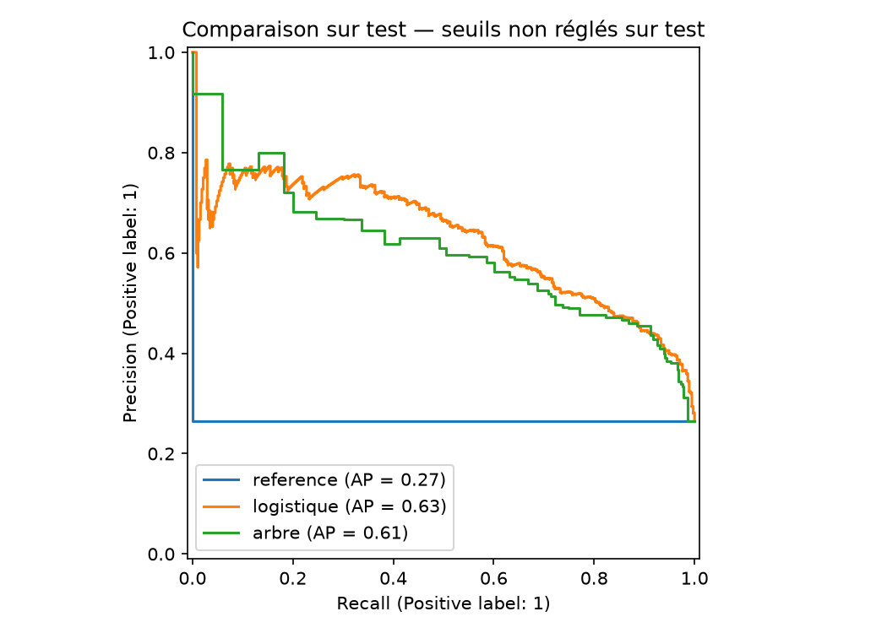

# Prédiction du départ des clients — Telco

** Comparer une référence, une régression logistique et un arbre, puis proposer un ciblage sous hypothèses explicites.



## Contexte

Données pédagogiques [IBM Telco Customer Churn](https://github.com/IBM/telco-customer-churn-on-icp4d). La cible `Churn` est binaire. Les données ne fournissent pas un historique daté permettant de prouver la disponibilité des variables avant le départ. Ce travail est donc une **classification rétrospective**, pas une validation temporelle d'un système de production.

## Installation et exécution

Python 3.12, depuis ce dossier :

```bash
python -m venv .venv
# Windows PowerShell : .\.venv\Scripts\Activate.ps1
# macOS/Linux : source .venv/bin/activate
pip install -r requirements.txt
python train.py
python -m unittest discover -s tests -v
```

Le CSV public est téléchargé au premier lancement. Les résultats inclus sont dans [reports/synthese.md](reports/synthese.md) et [reports/metrics.json](reports/metrics.json). Le pipeline sauvegardé est généré dans `models/churn.joblib` ; il n'est pas versionné par Git.

```bash
python train.py --fp-cost 10 --fn-cost 100
python predict.py nouveaux_clients.csv --output predictions.csv
```

Pour consulter le notebook : `pip install -r requirements-notebook.txt` puis ouvrir `notebooks/analyse.ipynb`. Il lit les résultats présents ; mettre `REBUILD=True` pour recalculer.

## Méthode

1. Contrôle des identifiants et de la cible ; conversion des valeurs vides de `TotalCharges` en valeurs manquantes.
2. Séparation stratifiée 60 % entraînement / 20 % validation / 20 % test, graine 42.
3. Imputation, standardisation et encodage dans un `Pipeline`, ajustés à l'intérieur de chaque pli d'entraînement. `customerID`, la cible et `gender` ne sont pas utilisés comme variables explicatives.
4. Recherche de paramètres par validation croisée à cinq plis, optimisant l'average precision sur entraînement uniquement.
5. Choix du modèle sur l'average precision de validation. Seuil choisi sur validation pour minimiser `10 × FP + 100 × FN` par défaut, avec recherche documentée ; seuil le plus élevé en cas d'égalité de coût.
6. Évaluation unique de la stratégie choisie sur test. Comparaison supplémentaire de tous les modèles au seuil fixe 0,5, sans modifier la sélection après lecture du test.
7. Importance par permutation sur validation, simulation de ciblage et comparaison du taux de churn du premier quintile au taux de base.

**Average precision** est la métrique calculée par scikit-learn ; elle n'est pas l'intégration trapézoïdale d'une courbe PR. Les scores de classification ne sont pas nécessairement des probabilités calibrées.

## Livrables

- `train.py` : données, entraînement, sélection, évaluation et graphiques.
- `predict.py` : inférence sur un fichier compatible, sans cible requise.
- `reports/threshold_validation.csv` : sensibilité au seuil.
- `reports/importance_validation.csv` : dépendance prédictive aux variables.
- `reports/targeting_test.csv` : exemple rétrospectif, pas campagne réelle.
- `reports/partitions.csv` : audit de la séparation des clients.
- `tests/` : tests de qualité et de frontière du prétraitement.

## Limites et suites métier

Les coûts sont illustratifs : ils ne chiffrent pas le bénéfice d'une rétention réussie. Le ciblage n'a pas été testé en campagne et aucune réduction réelle du churn n'est annoncée. Vérifier le droit d'utiliser les attributs retenus, la dérive, la calibration et les écarts de performance entre groupes avant utilisation opérationnelle. Les données ne justifient aucune causalité.

Une expérimentation A/B doit mesurer le gain incrémental, le coût de contact et la marge conservée. Répéter les essais sur les mêmes données de test finirait par invalider leur indépendance : constituer un nouveau test pour une nouvelle phase de développement.

## Sources et transparence

- Données et description : dépôt IBM ci-dessus ; conserver les conditions de la source. CSV exclu du dépôt.
- [Tutoriel sélectionné dans le portfolio](https://www.youtube.com/watch?v=lkPSmzFeNvI).
- [Documentation des métriques scikit-learn](https://scikit-learn.org/stable/modules/model_evaluation.html).

Implémentation créée avec assistance IA depuis le descriptif du portfolio ; aucun code historique fourni n'a été récupéré. Les résultats fournis proviennent de l'exécution de cette version. Charger uniquement les fichiers `joblib` générés localement ou d'une source de confiance.
